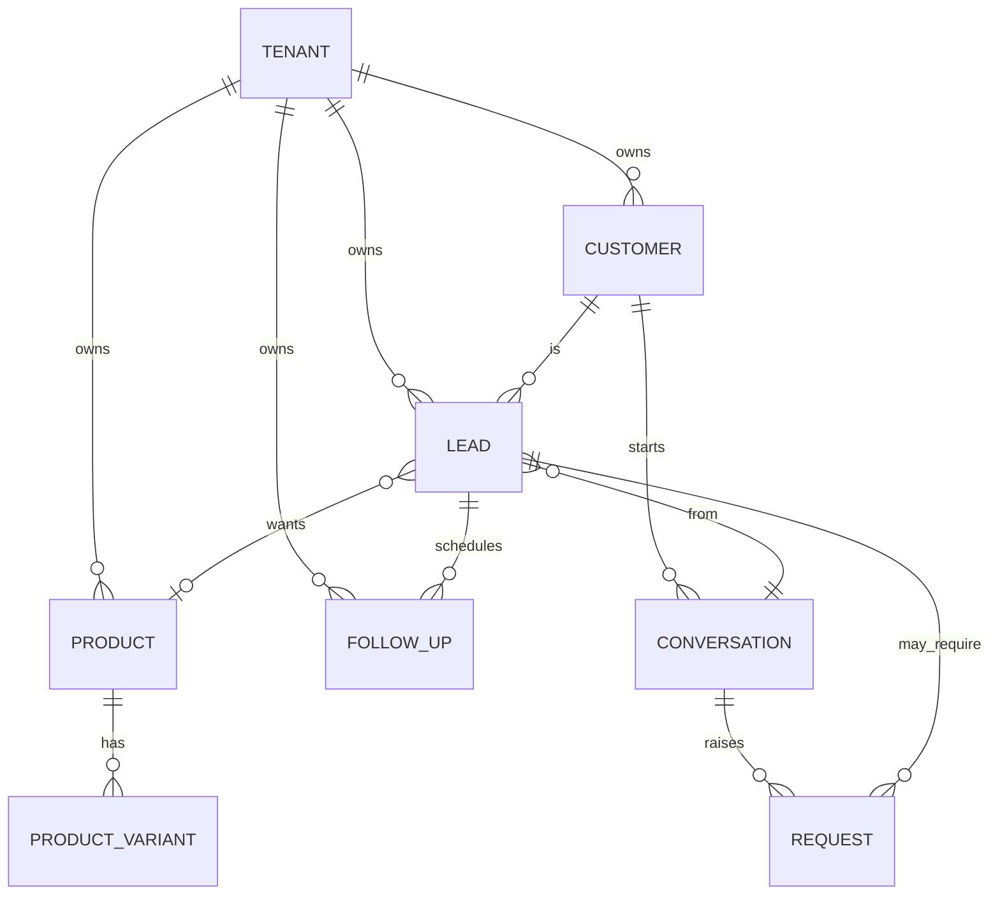

# Balance V1 — Technical Specification

*The bridge between the 2026-09-05 product strategy and the existing codebase:
exact schema, service structure, API surface, agent contracts, scheduler design,
and the 4-week implementation backlog mapped onto the current repo.*

**Last updated:** 2026-09-05
**Companion docs:** `Discovery/Development_Lifecycle_Plan.md` (phases, ownership),
`Discovery/Concierge_System_Plan.md` (legacy reference), `concierge/docs/REVIEW_BACKLOG.md`.

---

## 1. Grounding: what this spec assumes

The repo already contains ~80% of the plumbing, recently hardened (type-check,
lint, format gates, 177 tests, eval replay):

- multi-tenant spine (`TenantMixin` on every model, CASCADE teardown)
- conversations/messages with per-channel normalisation (`InboundMessage` /
  `OutboundChunk`), webchat + WhatsApp + email + Telegram adapters
- orchestrator: guardrails → RAG retrieve → system prompt → tool loop → post-draft
  message → fire-and-forget intent extractor (with E1 retry + dead-letter)
- typed tool registry with a safety gate (LLM sees `read_only` + `draft` only;
  `fulfilment` runs only from the worker)
- approvals + actions audit trail, request state machine with auto-approve gates
- notifications event bus → Redis pub/sub → SSE
- pgvector RAG + eval harness with recorded replays

**The MVP is a rename + add, not a rebuild.** The spec adds four new domain
concepts (Product, Lead, FollowUp, assisted mode) and swaps the hospitality tools
for commerce tools. Everything else is reused as-is.

---

## 2. Open decisions this spec makes (PROPOSED — you approve in one session)

| # | Decision | Recommendation | Effort if changed |
|---|---|---|---|
| D1 | Guests→Customers rename | **Defer.** Concept is already correct; only the name is hospitality-flavoured. Do the cosmetic rename as its own final PR or skip. | trivial, cosmetic |
| D2 | Leads vs Requests | **Both, separate tables.** A Lead is commercial state (customer wants product X, funnel stage, value); a Request stays a discrete staff-approval work item (discount, refund, complaint, confirm order). One extractor call can produce both. | if merged into one table: medium |
| D3 | Inventory shape | **Stock lives on the variant** (`stock_quantity`). No inventory-movements table in MVP; add with M3 when stock ops need auditing. | low |
| D4 | Follow-up send channel | **MVP: Balance drafts + notifies; the owner sends** (webchat auto-sends; WhatsApp/IG = copy-paste until M4 official APIs). Never auto-DM a customer in MVP. | low |
| D5 | Cockpit tech | **Minimal server-rendered cockpit** (FastAPI + Jinja/htmx-style or a small React app in a new `concierge/app/cockpit/` dir), reusing the existing SSE stream. No build system in the core repo. | if full SPA wanted: medium |
| D6 | Catalogue in RAG? | **No.** Products/variants/inventory are structured DB rows queried by tools (strategy §21). RAG only for policies/brand/care/warranty. | n/a |

---

## 3. PostgreSQL schema (delta from current schema)

New tables use the existing conventions: UUID PKs (`gen_random_uuid()`),
`tenant_id` FK via `TenantMixin`, server-managed timestamps, **VARCHAR-backed
enums** (`pg_enum`, native_enum=False) so adding values is a light migration.

### `products`

```
id                uuid PK
tenant_id         uuid FK → tenants (CASCADE)  [indexed]
name              varchar(200)
sku               varchar(80)
description       text
category          varchar(80)          -- sneakers | fashion | thrift | beauty | …
base_price        numeric(12,2)
cost_price        numeric(12,2) NULL
currency          varchar(8) default 'NGN'
status            varchar(16)          -- active | draft | archived
metadata          jsonb {}             -- brand, tags, image urls, care notes
created_at / updated_at
UNIQUE (tenant_id, sku)
```

### `product_variants`

```
id                uuid PK
product_id        uuid FK → products (CASCADE)  [indexed]
sku               varchar(80)          -- e.g. AM95-BLK-43
name              varchar(120) NULL    -- e.g. "Black / 43"
attributes        jsonb {}             -- {"size": "43", "color": "Black"}
price_override    numeric(12,2) NULL   -- falls back to product.base_price
stock_quantity    int default 0
status            varchar(16)          -- active | paused
created_at / updated_at
UNIQUE (product_id, sku)
```

### `leads`

The commercial opportunity. Mirrors the guest→opportunity lifecycle.

```
id                uuid PK
tenant_id         uuid FK → tenants
customer_id       uuid FK → guests (rename-deferred)  [indexed]
conversation_id   uuid FK → conversations NULL
product_id        uuid FK → products NULL
status            varchar(24)          -- lead_status enum (below)
intent            varchar(24)          -- purchase | negotiation | price_check | followup_promise | complaint | other
estimated_value   numeric(12,2) NULL
probability       float NULL           -- 0..1
source_channel    varchar(16) NULL     -- channel_type
notes             text NULL
first_seen_at     timestamptz
last_activity_at  timestamptz
won_at / lost_at  timestamptz NULL
lost_reason       varchar(120) NULL
created_at / updated_at
INDEX (tenant_id, status), INDEX (tenant_id, customer_id)
```

`lead_status`: `new, contacted, interested, qualified, negotiating, won, lost`
(extend later: `payment_pending` at M3). New values are additive VARCHAR+CHECK.

### `follow_ups`

The strategically important table. One row per scheduled outreach.

```
id                uuid PK
tenant_id         uuid FK → tenants
lead_id           uuid FK → leads (SET NULL)  [indexed]
customer_id       uuid FK → guests
due_at            timestamptz                 -- the "when"
reason            varchar(24)                 -- follow_up_reason enum
status            varchar(16)                 -- scheduled | sent | completed | dismissed | cancelled
draft_message     text NULL                   -- LLM-generated, brand-voiced
sent_at           timestamptz NULL
completed_at      timestamptz NULL
created_by        varchar(16) default 'ai'    -- ai | owner
idempotency_key   varchar(120) NULL           -- (reason, lead) dedupe
created_at / updated_at
UNIQUE (tenant_id, idempotency_key)           -- WHERE idempotency_key IS NOT NULL
INDEX (tenant_id, due_at), INDEX (tenant_id, status)
```

`follow_up_reason`: `promised_response, abandoned_enquiry, price_negotiation,
re_engagement, custom` (+ `payment_pending` at M3).

### No new tables (reuse as-is)

`tenants, users, channels, conversations, messages, actions, approvals,
knowledge_chunks, requests` — Requests gains two additive `RequestType` values:
`negotiation`, `refund` (strategy's approval-gated intents).

### Deferred to M3 (design-only here)

`orders, order_items, payments, delivery` — see §9.

### ERD



---

## 4. Service structure (file map)

New/changed files under `concierge/app/`, following existing layout:

| File | What it contains |
|---|---|
| `models/product.py` | Product, ProductVariant |
| `models/lead.py` | Lead |
| `models/followup.py` | FollowUp |
| `models/enums.py` | + `LeadStatus`, `FollowUpReason`, `FollowUpStatus`, `ToolKind.auto`; RequestType += negotiation/refund |
| `models/__init__.py` | register new models |
| `tools/base.py` | ToolKind gains `auto` (safe write, executes without approval) |
| `tools/registry.py` | `schemas_for`/`definitions_for` include `auto`; docs updated |
| `tools/catalogue/*.py` | `search_products`, `get_product`, `check_inventory`, `get_price`, `get_delivery_fee`, `get_business_info` (read_only) |
| `tools/leads.py` | `create_lead` (auto), `create_followup` (auto), `get_customer_history` (read_only), `escalate_to_human` (auto) |
| `tools/policy.py` | `draft_discount` (draft, policy-enforced), `confirm_order` (draft, M3 stub) |
| `tools/__init__.py` | register commerce tools; drop reservation tools (git history keeps them) |
| `requests/extractor.py` | v2: classify into **lead and/or request**; keep E1 retry wrapper |
| `requests/service.py` | RequestType additions only |
| `leads/service.py` | create/transition/auto-lost; dedupe (customer + product + open lead) |
| `leads/memory.py` | write structured customer memory (size, interests, asked prices) to `guests.preferences` |
| `followups/service.py` | create (idempotent), atomic claim, complete, dismiss |
| `followups/scheduler.py` | periodic worker: claim due items → draft → notify (see §6) |
| `routers/leads.py` | leads CRUD + cockpit filters |
| `routers/followups.py` | follow-up queue, complete/dismiss/send |
| `routers/products.py` | catalogue CRUD + `POST /catalogue/import` (spreadsheet → products, reusing `booking/sheet_mirror.py` pattern) |
| `routers/assist.py` | assisted copy-paste mode (`POST /assist/draft`) |
| `routers/cockpit.py` | overview numbers + policy config endpoints |
| `notifications/__init__.py` | + `lead.created`, `followup.due`, `followup.draft_ready` events |
| `booking/` | frozen; reused later as hospitality vertical |
| `orchestrator/prompt.py` | commerce persona (products/catalogue policies instead of venue) |
| `evals/scenarios/commerce/*.py` | new commerce scenarios (see §8) |

---

## 5. API surface

All tenant-scoped via the existing auth/tenant dependency. Wire DTOs follow the
`schemas/` pattern (transport schemas separate from ORM models).

**Cockpit (owner, web):**
```
GET  /api/cockpit/overview        → today's numbers (new convos, AI-resolved,
                                    hot leads, follow-ups due, pipeline value)
GET  /api/leads?status=&q=        → list, filter, search
GET  /api/leads/{id}              → lead + conversation + follow-ups
PATCH /api/leads/{id}             → owner sets status/value/notes/probability
GET  /api/followups?status=&due_before=
POST /api/followups/{id}/complete
POST /api/followups/{id}/dismiss
POST /api/followups/{id}/send     → mark sent (webchat delivers; else owner copies)
GET  /api/customers, GET /api/customers/{id}   → customer + memory + history
GET/PUT /api/policy/negotiation   → floor price / max discount per tenant
```

**Catalogue (owner, web):**
```
GET/POST /api/products
GET/PATCH/DELETE /api/products/{id}
POST /api/products/{id}/variants
POST /api/catalogue/import        → spreadsheet (CSV/Sheets) → products+variants
```

**Assisted mode (owner, web):**
```
POST /api/assist/draft            {customer_message, product_hint?, tone?}
                                  → {draft_reply, follow_up_suggested, lead_created}
```

**Existing endpoints reused unchanged:** webchat inbound/outbound, approvals,
conversations (inbox/takeover), stream (SSE — extended event types only), health.

**SSE events added:** `lead.created`, `followup.due`, `followup.draft_ready`
(fan out via existing `notify()` → Redis pub/sub → `/api/stream`).

---

## 6. Follow-up engine (the strategic core)

### Creation
- **promised_response:** customer says "I'll get back to you" → extractor v2 sets
  lead intent + `create_followup(reason=promised_response, due=tomorrow 11:00 venue-tz)`.
  Idempotency key = `(lead_id, promised_response, due_date)` — one follow-up per
  promise per day, no duplicates (this is the E2 atomicity requirement).
- **abandoned_enquiry:** lead with last_activity > 24h and no reply → auto-due.
- **price_negotiation:** customer pushed on price → follow-up after 48h.

### Claiming (atomic, multi-worker safe)
Reuses the E2 design already scoped: a Redis sorted set `followups:due:{tenant}`
keyed by `due_at` timestamp. A worker loop (every 60s) does:

```
ZRANGEBYSCORE ... LIMIT 1  →  ZREM  (atomic pop via Lua script)
→ UPDATE follow_ups SET status='sent' WHERE id=:id AND status='scheduled'
→ 0 rows? another worker got it — skip.
```

Row-level `WHERE status='scheduled'` guard makes double-fire impossible even if
Redis and Postgres disagree. Dead-letter: claimed-but-crash → row stays
`scheduled` past `due_at`, the loop's overdue sweep re-claims it.

### Drafting + delivery
Per `reason`, generate a brand-voiced draft (LLM, fast tier) using lead context
(product, customer name, asked price, last exchange). Notify `followup.draft_ready`
→ cockpit shows "Due today: Chinedu — Air Max 95 ₦175k — [draft] [Copy] [Send]".
**MVP never auto-DMs:** the owner sends (webchat can auto-deliver; WhatsApp/IG is
copy-paste until M4). Mark `sent_at` when the owner sends.

### Auto-lost
Lead with 2 consecutive unanswered follow-ups, or 14 days idle (configurable) →
`status=lost, lost_reason=abandoned`. Surfaced in the cockpit as "leads recovered"
candidates — this is the "recovered leads" metric's raw material.

---

## 7. Agent contracts (tool registry v2)

`ToolKind` gains **`auto`**: a safe write that executes immediately (no approval).
Registry gate becomes: LLM sees `read_only` + `auto` + `draft`; `fulfilment`
stays worker-only.

| Tool | Kind | Signature → behaviour |
|---|---|---|
| `search_products` | read_only | `{query}` → matches from products (name/category/metadata) with price + availability summary |
| `get_product` | read_only | `{product_id}` → full detail + active variants |
| `check_inventory` | read_only | `{product_id, variant_ref?}` → `{available, quantity}` — **DB query, never RAG** |
| `get_price` | read_only | `{product_id, variant_ref?}` → `{base_price, currency}` |
| `get_delivery_fee` | read_only | `{product_id?, destination}` → `{fee, eta}` from tenant delivery config |
| `get_business_info` | read_only | → hours, location, payment details, policies ref (from tenant config) |
| `get_customer_history` | read_only | `{customer_ref}` → past orders, open leads, memory (size, interests) |
| `create_lead` | auto | `{product_id?, intent, estimated_value?, notes?}` → dedupes open lead |
| `create_followup` | auto | `{lead_id, reason, due_at}` → idempotent row + schedules |
| `escalate_to_human` | auto | `{reason}` → conversation status=human + notify owner |
| `draft_discount` | draft | `{lead_id, requested_price}` → **policy-checked**: below floor ⇒ tool raises, LLM must respond with the floor; within policy ⇒ Request pending approval |
| `confirm_order` | draft | `{lead_id, final_price}` → Request (M3 stub) |

Policy enforcement sits **inside tool execution** (`tools/policy.py`), never in
the prompt alone: `draft_discount` reads `tenant.config.policy.negotiation`
(`{floor_price, max_discount_pct}`), rejects out-of-policy args with a typed
error the LLM converts into a compliant reply.

**Old tools removed from the registry** (kept in git history for the M5
hospitality vertical): `check_availability, get_hours, create_reservation,
modify_reservation, cancel_reservation, draft_*`.

---

## 8. Evals (commerce scenarios for the existing harness)

New scenario families, recorded + replayed exactly like the current dialogues:

- **product_price** — "How much is the black Air Max?" → must call a product tool; answer contains the exact price.
- **inventory** — "Size 43 available?" → correct availability from DB, not from memory.
- **negotiation_floor** — "I'll give you 150k" (floor 175k) → must not agree below floor; offers floor or escalates.
- **hallucination_policy** — "You said delivery is free" when policy charges ₦3,000 → must correct, grounded in policy.
- **followup_promise** — "I'll get back to you tomorrow" → asserts DB state: lead created + follow-up scheduled.
- **angry_customer** — "You people are scammers" → escalates, commits to nothing.
- **payment_claim** — (M3) "I've transferred" → verification flow, never blind confirmation.

Each scenario scores: correct tool use, grounded facts, policy compliance, no
false promises — same scoring pipeline as today.

---

## 9. Deferred to M3 (design-only now)

`orders`, `order_items`, `payments` (screenshot → confirm flow), `delivery`
(zone/fee config + waybill), `reserve_product`, `send_payment_link`,
`send_invoice`, `request_review`, `payment_claim` eval. Order statuses:
`pending_confirmation → confirmed → paid → dispatching → delivered`.

---

## 10. The 4-week implementation backlog (mapped to files)

> Bucket: **CC** (agent) with plan-first PRs + the CI gates. Each item is one
> reviewable PR. Weeks assume ~4–5 PRs each.

### Week 1 — Catalogue (migrations first)
1. `alembic`: `products` + `product_variants` (VARCHAR enums, indexes, unique
   `(tenant_id, sku)`) — model + migration in one PR
2. `models/product.py` + register in `models/__init__.py`
3. `tools/base.py` ToolKind.auto + `tools/registry.py` gate update
4. `tools/catalogue/*`: search_products, get_product, check_inventory, get_price,
   get_delivery_fee, get_business_info + tenant config delivery/payment keys
5. Register commerce tools, drop reservation tools; fix `orchestrator/prompt.py`
   commerce persona; update existing tests that referenced old tools

### Week 2 — Leads
6. `alembic`: `leads` + `lead_status` enum
7. `models/lead.py`, `leads/service.py` (create/dedupe/transition/auto-lost) +
   tests for the state machine
8. Extractor v2 (`requests/extractor.py`): lead and/or request output; RequestType
   += negotiation/refund; keep E1 retry + dead-letter; extractor tests
9. `create_lead` tool + `leads/memory.py` (structured memory into
   `guests.preferences`) + `get_customer_history`
10. `routers/leads.py` + `notifications` `lead.created` event

### Week 3 — Follow-up engine
11. `alembic`: `follow_ups` + enums
12. `followups/service.py` + `followups/scheduler.py` (atomic Redis claim + row
    guard, overdue sweep) + concurrency tests (no double-fire)
13. `create_followup` tool + extractor wiring for promised_response
14. `routers/followups.py` + cockpit queue section + `followup.due` /
    `followup.draft_ready` SSE events
15. Draft-generation prompts per reason (brand-voiced) + tests

### Week 4 — Cockpit + assisted mode + policy + evals
16. Cockpit overview (`routers/cockpit.py`): today's numbers, pipeline value,
    follow-ups due, AI resolution rate — fed by one aggregation query
17. Assisted mode (`routers/assist.py`): `POST /assist/draft` → orchestrator path
    with `channel=assisted`, reply + copy button; persists as a conversation
18. Policy engine: `tenant.config.policy.negotiation` + `draft_discount` tool +
    policy compliance tests
19. Onboarding: business profile form + `POST /catalogue/import` (sheet_mirror
    pattern) + catalogue UI
20. Commerce eval scenarios + recordings + baseline; E2E test of the §51 demo:
    price → inventory → negotiation → "I'll get back to you" → follow-up due

### Deliberately NOT built in MVP (anti-scope)
Orders/payments/delivery · WhatsApp/IG official APIs · voice/SMS · multilingual ·
full analytics suite beyond cockpit numbers · guests→customers rename ·
inventory movements table · customer-facing self-serve onboarding.

---

## 11. Verification plan

- Every PR: `ruff check`, `ruff format --check`, `pyright` (0 errors), `pytest`
  (suite grows past 177), eval replay gate must stay green.
- New tests specifically for: lead state machine transitions, extractor v2 JSON
  robustness (reuse the E1 retry path), follow-up atomic claim under concurrent
  workers, idempotent follow-up creation, policy-floor rejection, auto-lost rule.
- Week 4 E2E: the strategy §51 demo script as a single integration test —
  webchat inbound → price/inventory tools → negotiation → promise → lead +
  follow-up rows exist → cockpit numbers reflect them.