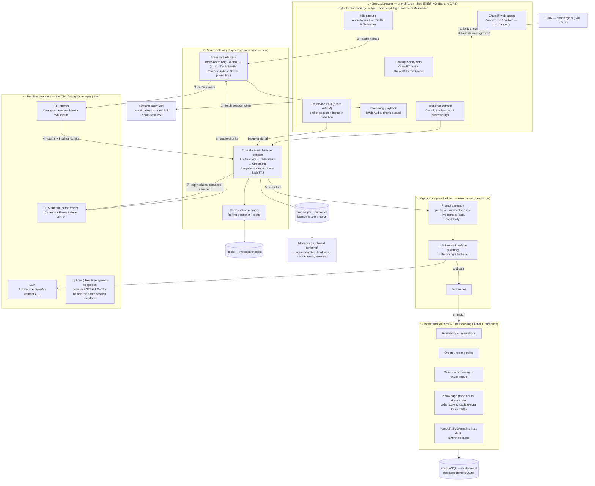

# Graycliff Voice Concierge — Production Architecture

**Status:** engineering design, v1 — 2026-07-10
**Replaces:** the demo `/voice` page (browser SpeechRecognition + speechSynthesis)
**Goal:** an intelligent, real-time conversational voice agent that guests use **on graycliff.com itself** — reservations, questions, and orders by natural conversation. No separate platform, no app install.

---

## 1. Why the demo approach cannot ship

| Demo (today) | Problem in production |
|---|---|
| Browser `SpeechRecognition` | Chrome-only reliability, no streaming partials we control, no accuracy tuning for "Graycliff", "conch", "Junkanoo", guest accents |
| Browser `speechSynthesis` | Robotic OS voice — a five-star property cannot sound like a GPS. No brand voice, no prosody control |
| One-shot request/response | No multi-turn context, no clarifying questions, no interruption ("actually, make that 8:30") |
| Logic in the page | Cannot be reused for a phone line; nothing works outside our own SPA |

The production system is a **streaming voice pipeline** the guest talks *with*, not a form they talk *at*.

---

## 2. System overview

Three stable layers, one replaceable layer — the same isolation pattern as our
LLMService (`llm_service.py`): app logic never touches a vendor; every vendor
sits behind a wrapper that can be swapped in `.env`.



**The demo `/voice` page stays** as an internal test console; guests get the widget.

---

## 3. The conversation loop, precisely

```mermaid
sequenceDiagram
    autonumber
    participant G as Guest (mic)
    participant W as Widget (VAD)
    participant GW as Voice Gateway
    participant S as STT stream
    participant A as Agent (LLM + tools)
    participant API as Actions API
    participant T as TTS stream

    G->>W: "Do you have a table for four on Friday…"
    W->>GW: audio frames (while speaking)
    GW->>S: forward frames
    S-->>GW: partial transcripts (~200 ms cadence)
    Note over W,GW: VAD detects end of speech (~200 ms silence)
    S-->>GW: final transcript
    GW->>A: user turn + conversation memory
    A->>API: tool: check_availability(2026-07-17, 4)
    API-->>A: 19:00 ✗ · 19:45 ✓ · 20:30 ✓
    A-->>GW: streaming reply tokens
    GW->>T: first full sentence → synthesize
    T-->>W: audio chunks (stream, ~200 ms to first sound)
    W->>G: "Friday at seven is fully committed, but I can offer…"
    G->>W: (interrupts) "8:30 works"
    W->>GW: barge-in signal
    GW->>T: cancel synthesis, flush queue
    GW->>A: cancel stream; new turn "8:30 works"
    A->>API: tool: create_reservation(…, 20:30, 4)
    API-->>A: confirmed #1287
    A-->>GW: confirmation + SMS offer
    GW->>T: synthesize
    T-->>G: "Wonderful — Friday the 17th at 8:30 for four…"
```

### Latency budget (voice-to-voice)

| Stage | Target | How |
|---|---|---|
| End-of-speech detection | 150–250 ms | on-device VAD, not server round-trip |
| STT final after EOS | ~150 ms | streaming STT already has the audio |
| LLM first token | 250–400 ms | `fast` tier (Haiku-class), tools pre-declared |
| TTS first audio | 150–250 ms | sentence-chunked streaming synthesis |
| Network overhead | ~100 ms | region close to the Bahamas (us-east) |
| **Total** | **✅ 700–1,100 ms** | perceived as natural turn-taking |

Barge-in: VAD fires while agent audio is playing → gateway cancels the LLM stream and TTS queue within one frame (~20 ms) — the agent *stops talking when interrupted*, which is 80 % of what makes it feel human.

---

## 4. The agent's tools (function calling)

| Tool | Backing endpoint (exists today) | Notes |
|---|---|---|
| `check_availability(date, party)` | `GET /api/reservations?date=` + capacity rules | returns alternatives, never a bare "no" |
| `create_reservation(...)` | `POST /api/reservations` | confirms back; optional SMS via Twilio |
| `answer_menu_question(query)` | `GET /api/menu` + knowledge pack | dietary flags, prices, wine pairings |
| `recommend(guest_id?, context)` | `GET /api/recommendations` | the existing hybrid recommender |
| `start_order / add_item / confirm_order` | `POST /api/orders` | room-service & pre-order (phase 2) |
| `get_property_info(topic)` | knowledge pack table | hours, dress code, cellar tours, directions |
| `handoff_to_host(reason)` | SMS/email to host desk + transcript | the agent must know when to stop |

**Knowledge pack** = per-restaurant table (multi-tenant key: `restaurant_id`) holding structured facts + freeform FAQ paragraphs, editable from the manager dashboard. Assembled into the system prompt each session — no fine-tuning needed, updates are instant.

**Persona:** written once per property. Graycliff's: warm, unhurried, "our" not "the", offers the cellar story when asked about wine, never says "as an AI".

---

## 5. Website integration — one script tag

```html
<!-- pasted once into graycliff.com's template footer -->
<script async src="https://cdn.pythaflow.com/concierge.js"
        data-restaurant="graycliff"></script>
```

- **Shadow DOM** — zero CSS bleed in either direction; safe on any CMS (WordPress, Wix, custom).
- **Theming** per tenant from our config API (Graycliff: charcoal/gold, serif wordmark) — *their* brand, not ours.
- **Security:** the script holds no secrets. It requests a short-lived session JWT from the Token API, which enforces an **Origin allowlist** (graycliff.com only), per-IP rate limits, and session TTLs. All provider keys live server-side.
- **Consent & GDPR:** explicit mic-permission UI with a one-line notice; audio is processed in transit and **not stored** (transcripts are, linked to the booking, with a deletion endpoint). Region pinning per tenant.
- **Progressive degradation:** no mic permission → text chat (same agent). Gateway unreachable → widget shows the phone number and reservation link, never a broken UI. `async` script — can never slow or break the host page.
- **Accessibility:** captions of agent speech rendered live in the panel (WCAG), full keyboard operation.

---

## 6. Build vs. buy — decision record

| Option | Verdict | Why |
|---|---|---|
| **Cascaded pipeline** (streaming STT → LLM → streaming TTS) behind our own gateway | ✅ **chosen** | Full control of brand voice, prompt, tools, data; each stage swappable (consistent with our LLMService isolation); per-session cost ~3–6× cheaper than managed platforms; the gateway is reusable for the phone channel |
| Managed voice-agent platform (Vapi / Retell / Bland) | ❌ rejected | Vendor lock-in at the *whole-agent* level (the exact thing we just architected away), per-minute pricing erodes margin at scale, limited brand-voice control, guest audio transits a third party's platform |
| Realtime speech-to-speech API (e.g. OpenAI Realtime) as the whole brain | 🔶 optional provider | Excellent latency, but single-vendor coupling for the entire experience. Supported as **one more wrapper** behind the same session interface — we can A/B it, never depend on it |
| Browser Web Speech (demo) | ❌ demo only | §1 |

Default stack (all swappable): **Deepgram** (streaming STT) · **Claude via existing LLMService** (`fast` tier for turns) · **Cartesia or ElevenLabs** (streaming brand-voice TTS) · **Silero VAD** (on-device WASM).

### Cost per conversation (~3 min, honest estimate)

| Item | Cost |
|---|---|
| STT streaming | ~$0.02 |
| LLM (fast tier, ~6 turns + tools) | ~$0.01–0.03 |
| TTS (~350 words) | ~$0.05–0.10 |
| **Total** | **≈ $0.10–0.15 / conversation** |

A completed reservation is worth $200+ in covers at Graycliff. Update the add-on pricing: **$0.30 per completed voice booking** (not per order) reads better and covers cost at 2–3× margin.

---

## 7. What changes in our codebase

```
Graycliff/backend/
  app/services/llm_service.py      + streaming + tool-use in the interface
  app/services/providers/          + stt_*, tts_* wrappers (same pattern)
  app/routers/…                    + availability rules, knowledge-pack CRUD, handoff
voice-gateway/                     NEW async service (python, websockets)
  transport/ (ws, webrtc, twilio)  · session.py (turn state machine)
  agent.py (prompt assembly, tool router)
widget/                            NEW — vanilla TS, no framework, ~40 KB
  audio worklets · VAD wasm · panel UI · text fallback
```

Production hardening that rides along: SQLite → **Postgres**, demo-clock → real clock, **auth** on manager routes, `restaurant_id` on every table (multi-tenant from day one — the next restaurant is a config row, not a fork).

---

## 8. Rollout

| Phase | Scope | Effort |
|---|---|---|
| **V1** | Widget on graycliff.com: reservations + property/menu Q&A, text fallback, analytics | ~2–3 weeks |
| **V1.1** | WebRTC transport (echo cancellation, packet-loss resilience), multilingual (ES/FR) | ~1 week |
| **V2** | Voice ordering / room-service, returning-guest recognition (loyalty opt-in) | ~2 weeks |
| **V3** | **The phone line**: Twilio number → same gateway, after-hours answering, SMS confirmations | ~2 weeks |

V3 is the sleeper sales weapon: *"the same concierge answers your phone at 2 a.m. and books the table you would have lost."*

### KPIs on the manager dashboard
- Voice bookings / week and revenue attributed
- Containment rate (resolved without human handoff) — target ≥ 70 %
- Voice-to-voice latency p50/p95 — target ≤ 0.9 s / 1.5 s
- Conversation cost vs. booking value
```
