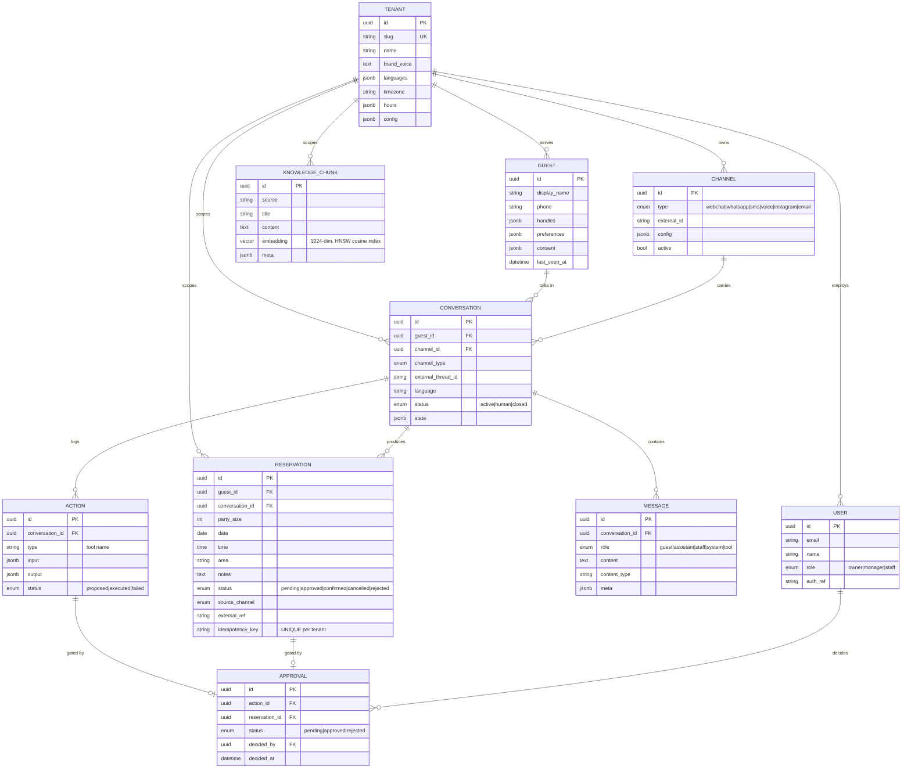

# Concierge — Entity-Relationship Diagram (Day 2)

`Tenant` is the root of isolation; **every other table carries `tenant_id`**
(omitted from the diagram bodies for readability — it's on all of them except
`tenants`). Enums are stored as VARCHAR + CHECK; primary keys are UUIDs.

