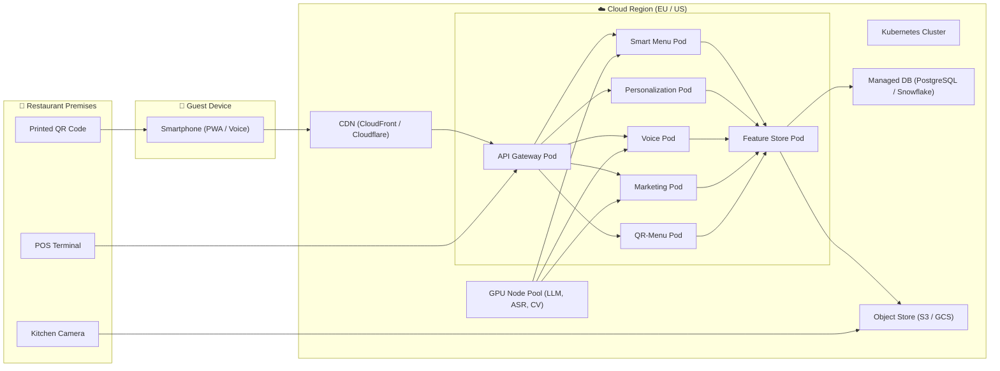

# Restaurant AI Solutions Overview

This document summarizes the five AI‑driven solutions we discussed for restaurants in the Caribbean, Central America, and European markets (Cyprus, Estonia, Ireland, Malta, etc.). Each section outlines the core functionality, high‑level architecture, key AI models, implementation roadmap, and business considerations.

---

## 1. Smart Menu & Dynamic Pricing

**What it does**
- Shows a visual, dynamic menu that adjusts prices in real time based on inventory, weather, local events, and demand forecasts.
- Reduces waste by forecasting dish demand and suggesting optimal pricing while respecting margin constraints.

**Architecture (simplified)**
```
ASR → Data Sources (POS, Inventory, Weather, Events) → Feature Store →
  • Computer‑Vision model (visual quality score)
  • Demand‑forecast model (time‑series)
  • Price‑elasticity model
→ Smart‑Menu Service (API) → POS & QR‑menu UI
```

**Key AI models**
- Computer‑Vision (EfficientNet fine‑tuned) → visual_score ∈[0,1]
- Demand forecast (Prophet / LightGBM / Temporal Fusion Transformer)
- Price‑elasticity (regression or contextual bandit)

**Roadmap highlights**
1. Data pipeline (POS, inventory, weather) – 3‑4 wks
2. Model development (CV, demand, pricing) – 4‑6 wks
3. API + UI integration – 3‑5 wks
4. Pilot in 2‑3 restaurants – 4‑6 wks
5. Scale with Docker/K8s, CI/CD – ongoing

**Business notes**
- SaaS pricing: $30 / restaurant / month (or revenue‑share).
- GDPR‑compliant data handling, multi‑language support.
- KPI: revenue uplift, waste reduction, average ticket size.

---

## 2. AI‑Powered Guest Personalization

**What it does**
- Provides personalized dish recommendations and promotions based on guest history, preferences, and real‑time context (weather, events, inventory).
- Enables segment‑level upsell and targeted marketing.

**Architecture (simplified)**
```
Feature Store ← Orders, Guest DB, Menu, Weather, Events
   ↓
Collaborative‑Filtering + Content‑Based → Hybrid scores
   ↓
Contextual Ranking (XGBoost/Transformer) → Personalized list
   ↓
Personalization API → Web / Mobile UI
```

**Key AI models**
- Collaborative Filtering (ALS or neural embeddings)
- Content‑Based similarity (ingredient TF‑IDF + visual embeddings)
- Contextual ranking (gradient‑boosted trees)
- Guest segmentation (K‑means / GMM)

**Roadmap highlights**
1. Data & ontology creation – 3‑4 wks
2. Model prototyping (CF + content) – 4‑5 wks
3. API + simple dialog UI – 3‑4 wks
4. Pilot & KPI collection – 4‑6 wks
5. Full scaling – ongoing

**Business notes**
- SaaS $25 / month + optional upsell‑share.
- Multilingual (English, Spanish, Greek, Estonian, Irish, Maltese).
- GDPR consent flow, human‑in‑the‑loop approval UI.
- KPI: conversion rate, average ticket, upsell lift.

---

## 3. Voice‑First Ordering & Reservation

**What it does**
- Allows guests to place orders or book tables using natural language (phone or web‑mic).
- Supports multiple languages and context‑aware follow‑ups.
- Pushes orders/reservations directly to the existing POS/reservation system.

**Architecture (simplified)**
```
Microphone / Phone → ASR (cloud or Whisper) → Intent & Entity Extraction →
Dialog Manager (state, slot filling) →
  • Order Builder → POS
  • Reservation Builder → Reservation System
→ TTS for spoken confirmations
```

**Key AI models**
- ASR (Google/Azure or Whisper)
- Multilingual intent classifier (BERT/XLM‑R)
- Entity extraction (token‑classification head)
- Dialog policy (rule‑based + RL for ambiguous cases)
- Dish name normalizer (fuzzy matching + embeddings)

**Roadmap highlights**
1. Choose ASR/TTS providers, collect multilingual utterance corpus – 2‑3 wks
2. Fine‑tune intent & entity models – 4‑5 wks
3. Build stateless Voice‑API + dialog manager – 3‑4 wks
4. Integrate with POS / reservation system – 3‑5 wks
5. Pilot (QR‑voice page + optional phone IVR) – 4‑6 wks
6. Scale with containers, CI/CD – ongoing

**Business notes**
- SaaS $20 / month + per‑call charge for phone IVR.
- GDPR‑compliant audio handling (delete recordings after processing).
- KPI: order accuracy, reservation conversion, handling time.
- Human‑in‑the‑loop fallback to text if confidence low.

---

## 4. AI‑Generated Marketing Content

**What it does**
- Generates localized social‑media posts, email/SMS newsletters, flyers, and ad copy.
- Personalizes messages per guest segment and incorporates upcoming events, weather, and best‑selling dishes.
- Provides a review UI for marketers to approve before publishing.

**Architecture (simplified)**
```
Feature Store ← Guest, Menu, Sales, Events, Weather
   ↓
LLM (fine‑tuned on restaurant copy) + Prompt‑tuning (brand voice)
   ↓
Content Service API → Scheduler → Email / SMS / Social / PDF generators
```

**Key AI models**
- Multilingual LLM (GPT‑style) fine‑tuned with LoRA on a curated corpus of restaurant marketing texts.
- Prompt‑tuning / style guide to enforce brand voice and compliance.
- Guest segmentation (same as personalization) for personalized placeholders.
- Optional ad‑performance predictor (XGBoost) to rank multiple variants.

**Roadmap highlights**
1. Build a multilingual corpus (5‑10 k examples) – 2‑3 wks
2. Fine‑tune LLM with LoRA adapters – 4‑5 wks
3. Implement Content API & approval UI – 3‑4 wks
4. Connect to email, SMS, and social‑media APIs – 3‑5 wks
5. Pilot with 2‑3 restaurants – 4‑6 wks
6. Scale (containerisation, nightly retraining) – ongoing

**Business notes**
- SaaS $30 / month + $0.02 per generated piece (optional).
- GDPR / CAN‑SPAM compliance (unsubscribe links, consent storage).
- KPI: open rate, click‑through, revenue lift from campaigns.
- Human‑in‑the‑loop approval required for compliance.

---

## 5. Contactless QR‑Menu with AI Upsell

**What it does**
- Guests scan a QR code to open a mobile‑friendly visual menu.
- AI suggests personalized add‑ons (e.g., “Add mango‑lime salsa?”) based on guest profile, inventory, weather, and margin.
- Orders are pushed directly to the POS; inventory updates in real time.
- Supports multiple languages and offline caching via a PWA.

**Architecture (simplified)**
```
QR → PWA (responsive web app) → Menu & Upsell Service API →
  Feature Store (guest segment, inventory, weather, events)
  Hybrid Recommendation (CF + content) → Contextual Ranking →
  Final upsell list returned to PWA
PWA → Order Builder → POS & Inventory
```

**Key AI models**
- Collaborative Filtering (ALS / neural embeddings)
- Content‑Based similarity (ingredients + visual score)
- Hybrid recommendation (linear blend or meta‑learner)
- Contextual ranking (XGBoost/Transformer) using margin, stock, weather, time, promotions.
- Optional image‑quality scorer for selecting the best dish photo.

**Roadmap highlights**
1. QR generation & static URL per restaurant – 2 wks
2. Data pipeline & feature store (POS, inventory, guest DB) – 3‑4 wks
3. Model prototyping (CF + content + context) – 5‑6 wks
4. Build stateless Menu API + PWA (offline‑first) – 4‑5 wks
5. POS integration (order JSON) – 3‑4 wks
6. Pilot in 2‑3 locations – 4‑6 wks
7. Scale with CDN caching, containers, CI/CD – ongoing

**Business notes**
- SaaS $25 / month + optional revenue‑share on upsell margin.
- Multilingual UI (language detection or `?lang=` param).
- GDPR‑compliant guest IDs (hashed), easy opt‑out.
- KPI: upsell conversion, average ticket increase, menu‑update latency.
- Human‑in‑the‑loop not required for the upsell UI, but a manager dashboard exists for monitoring.

---

## Summary Table

| Solution | Core AI | Main Benefits | Typical SaaS Price |
|----------|---------|----------------|--------------------|
| Smart Menu & Dynamic Pricing | CV + demand forecast + price‑elasticity | Real‑time price optimisation, waste reduction | $30 / month (or revenue‑share) |
| Guest Personalization | CF + content‑based + contextual ranking | Tailored recommendations, higher conversion | $25 / month |
| Voice‑First Ordering & Reservation | Multilingual ASR + intent/slot extraction | Hands‑free ordering, phone IVR, higher booking rate | $20 / month + per‑call fee |
| AI‑Generated Marketing Content | Fine‑tuned multilingual LLM + prompt‑tuning | Automated social/email copy, multilingual | $30 / month + $0.02 per piece |
| QR‑Menu with AI Upsell | Hybrid recommendation + context ranking | Contactless menu, personalized add‑ons, higher ticket | $25 / month + upsell‑share |

---

## Unified System Architecture — All Five Solutions as One Package

Below is the high‑level architecture when all five AI solutions are bundled into a single **Restaurant AI Platform**. The design follows a **layered, modular** approach where each solution is a self‑contained service that shares a common data backbone, feature store, and API gateway.

### Architecture Diagram

```mermaid
graph TD
    %% ── External Data Sources ──
    subgraph Data_Sources["🔌 External Data Sources"]
        POS["POS / Order System"]
        Inv["Inventory Management"]
        GuestDB["Guest / Loyalty DB"]
        ResSys["Reservation System"]
        Weather["Weather API"]
        Events["Local Events API"]
        Camera["Kitchen Camera"]
        Media["Image / Video Assets"]
    end

    %% ── Ingestion Layer ──
    subgraph Ingestion["📥 Ingestion Layer"]
        Stream["Stream Processor (Kafka / PubSub)"]
        Batch["Batch ETL (Airflow / Dagster)"]
        ImagePipe["Image Pipeline (Camera → S3 → Lambda)"]
    end

    %% ── Data Lake & Feature Store ──
    subgraph Data_Plane["🗄️ Data Plane"]
        DataLake["Data Lake (S3 / GCS / Blob)"]
        FS["Feature Store (Feast / SageMaker FS)"]
        AnalyticsDB["Analytics DB (Snowflake / BigQuery)"]
    end

    %% ── AI Model Serving Layer ──
    subgraph AI_Engine["🧠 AI Engine (Model Serving)"]
        CV["Computer Vision (Dish Quality)"]
        Forecast["Demand Forecast (Time‑Series)"]
        Elastic["Price Elasticity Model"]
        CF["Collaborative Filtering"]
        ContentSim["Content‑Based Similarity"]
        ContextRank["Contextual Ranking (XGBoost)"]
        Segmentation["Guest Segmentation (Clustering)"]
        ASR["ASR (Speech‑to‑Text)"]
        TTS["TTS (Text‑to‑Speech)"]
        IntentNER["Intent & Entity Extraction (BERT)"]
        DialogMgr["Dialog Manager"]
        LLM["LLM (Marketing Copy Gen)"]
        PromptTune["Prompt‑Tuning / Style Guide"]
        ImageRetrieval["Multimodal Image Retrieval"]
    end

    %% ── Solution Services (Business Logic) ──
    subgraph Services["⚙️ Solution Services"]
        SmartMenu["Smart Menu & Dynamic Pricing Service"]
        Personalization["Guest Personalization Service"]
        VoiceService["Voice‑First Ordering & Reservation Service"]
        MarketingService["AI‑Generated Marketing Content Service"]
        QRMenuService["QR‑Menu with AI Upsell Service"]
    end

    %% ── API Gateway ──
    subgraph Gateway["🌐 API Gateway"]
        APIGW["Unified API Gateway (Kong / AWS API GW / GCP Endpoints)"]
        Auth["Auth Service (OAuth2 / API Keys)"]
    end

    %% ── Front‑End & Distribution ──
    subgraph Frontend["📱 Front‑End & Distribution"]
        PWA["QR‑Menu PWA (React / Vue)"]
        VoiceUI["Voice Web UI / Phone IVR"]
        AdminUI["Restaurant Manager Dashboard"]
        EmailSrv["Email Service (SendGrid / Mailgun)"]
        SMSSrv["SMS Gateway (Twilio)"]
        SocialSched["Social Media Scheduler (Meta / TikTok API)"]
        PDFGen["PDF Generator (Flyers / Posters)"]
    end

    %% ── Restaurant Systems (External) ──
    subgraph Restaurant["🏪 Restaurant Systems"]
        POSOut["POS (Order Push)"]
        ResSysOut["Reservation System (Booking Push)"]
        InvOut["Inventory (Stock Update)"]
    end

    %% ── Monitoring & Ops ──
    subgraph Ops["🔧 Operations"]
        Monitoring["Prometheus + Grafana"]
        Logging["Centralised Logging (ELK / CloudWatch)"]
        CICD["CI/CD Pipeline (GitHub Actions / ArgoCD)"]
        ModelRegistry["Model Registry (MLflow)"]
    end

    %% ── Connections ──
    POS --> Stream
    Inv --> Stream
    GuestDB --> Stream
    ResSys --> Stream
    Weather --> Batch
    Events --> Batch
    Camera --> ImagePipe
    Media --> ImagePipe

    Stream --> DataLake
    Batch --> DataLake
    ImagePipe --> DataLake

    DataLake --> FS
    DataLake --> AnalyticsDB

    FS --> CV
    FS --> Forecast
    FS --> Elastic
    FS --> CF
    FS --> ContentSim
    FS --> ContextRank
    FS --> Segmentation
    FS --> IntentNER
    FS --> LLM
    FS --> ImageRetrieval

    CV --> SmartMenu
    Forecast --> SmartMenu
    Elastic --> SmartMenu

    CF --> Personalization
    ContentSim --> Personalization
    ContextRank --> Personalization
    Segmentation --> Personalization

    ASR --> VoiceService
    TTS --> VoiceService
    IntentNER --> VoiceService
    DialogMgr --> VoiceService

    LLM --> MarketingService
    PromptTune --> MarketingService
    Segmentation --> MarketingService
    ImageRetrieval --> MarketingService

    CF --> QRMenuService
    ContentSim --> QRMenuService
    ContextRank --> QRMenuService
    Segmentation --> QRMenuService

    SmartMenu --> APIGW
    Personalization --> APIGW
    VoiceService --> APIGW
    MarketingService --> APIGW
    QRMenuService --> APIGW

    Auth --> APIGW

    APIGW --> PWA
    APIGW --> VoiceUI
    APIGW --> AdminUI
    APIGW --> EmailSrv
    APIGW --> SMSSrv
    APIGW --> SocialSched
    APIGW --> PDFGen

    PWA --> POSOut
    VoiceUI --> POSOut
    VoiceUI --> ResSysOut
    PWA --> InvOut

    SmartMenu --> Monitoring
    Personalization --> Monitoring
    VoiceService --> Monitoring
    MarketingService --> Monitoring
    QRMenuService --> Monitoring

    Monitoring --> Logging
    CICD --> ModelRegistry
    ModelRegistry --> AI_Engine
```



### Layer‑by‑Layer Explanation

| Layer | What it Contains | Shared or Solution‑Specific |
|-------|------------------|-----------------------------|
| **External Data Sources** | POS, inventory, guest DB, reservation system, weather API, events API, kitchen camera, media assets. | **Shared** — all five solutions pull from the same sources. |
| **Ingestion Layer** | Streaming pipeline (Kafka/PubSub) for real‑time data (orders, inventory), batch ETL (Airflow/Dagster) for weather/events, and an image pipeline for kitchen photos. | **Shared** — one ingestion backbone feeds the entire platform. |
| **Data Plane** | Data lake (raw storage), feature store (engineered features), and analytics DB (for reporting & model retraining). | **Shared** — every solution reads/writes to the same feature store and analytics DB. |
| **AI Engine** | All ML models: CV, demand forecast, price elasticity, collaborative filtering, content similarity, contextual ranking, segmentation, ASR/TTS, intent/entity extraction, dialog manager, LLM, prompt‑tuning, image retrieval. | **Mixed** — some models are shared (segmentation, contextual ranking, CF), others are solution‑specific (ASR, LLM). |
| **Solution Services** | Five stateless microservices, each orchestrating its own business logic and calling the relevant AI models. | **Solution‑specific** — each service encapsulates one product. |
| **API Gateway** | Single entry point for all client requests. Handles routing, rate‑limiting, authentication (OAuth2/API keys), and request/response transformation. | **Shared** — one gateway for the entire platform. |
| **Front‑End & Distribution** | QR‑menu PWA, voice web UI / phone IVR, restaurant manager dashboard, email/SMS gateways, social media scheduler, PDF generator. | **Mixed** — PWA and voice UI are guest‑facing; dashboard is manager‑facing; distribution channels serve marketing content. |
| **Restaurant Systems** | The existing POS, reservation system, and inventory management that receive final orders, bookings, and stock updates. | **External** — owned by the restaurant, integrated via adapters. |
| **Operations** | Monitoring (Prometheus+Grafana), centralised logging (ELK/CloudWatch), CI/CD pipeline, and model registry (MLflow). | **Shared** — one ops stack for the whole platform. |

### Data Flow Summary (End‑to‑End)

1. **Ingest** — POS orders, inventory changes, guest profiles, reservations, weather, events, and kitchen images flow into the ingestion layer (stream + batch + image pipeline).  
2. **Store** — Raw data lands in the data lake; engineered features are computed and pushed to the feature store; analytics events are logged to the analytics DB.  
3. **Score** — Each solution service calls the relevant AI models, which read from the feature store and return predictions/scores.  
4. **Serve** — Solution services expose REST/gRPC endpoints that are routed through the unified API gateway.  
5. **Deliver** — The gateway serves the QR‑menu PWA, voice UI, manager dashboard, and triggers email/SMS/social distribution.  
6. **Push Back** — Orders and reservations are pushed back to the restaurant's POS and reservation system; inventory updates are sent to the inventory system.  
7. **Learn** — All interactions (orders, upsell accepts/rejects, voice transcripts, marketing engagement) are logged to the analytics DB and used to retrain models nightly via the CI/CD pipeline and model registry.  

### Shared vs. Solution‑Specific Components

| Component | Shared? | Used By |
|-----------|---------|---------|
| Data ingestion (Kafka, Airflow) | ✅ Shared | All 5 solutions |
| Data lake & feature store | ✅ Shared | All 5 solutions |
| Analytics DB | ✅ Shared | All 5 solutions |
| API Gateway & Auth | ✅ Shared | All 5 solutions |
| Monitoring, logging, CI/CD, model registry | ✅ Shared | All 5 solutions |
| Guest segmentation model | ✅ Shared | Personalization, Marketing, QR‑Menu |
| Contextual ranking model | ✅ Shared | Personalization, QR‑Menu |
| Collaborative filtering model | ✅ Shared | Personalization, QR‑Menu |
| Computer vision (dish quality) | 🔶 Specific | Smart Menu |
| Demand forecast | 🔶 Specific | Smart Menu |
| Price elasticity | 🔶 Specific | Smart Menu |
| ASR / TTS | 🔶 Specific | Voice |
| Intent & entity extraction | 🔶 Specific | Voice |
| Dialog manager | 🔶 Specific | Voice |
| LLM + prompt‑tuning | 🔶 Specific | Marketing |
| Multimodal image retrieval | 🔶 Specific | Marketing |
| Content‑based similarity | 🔶 Specific | Personalization, QR‑Menu |
| Smart Menu Service | 🔶 Specific | Smart Menu |
| Personalization Service | 🔶 Specific | Personalization |
| Voice Service | 🔶 Specific | Voice |
| Marketing Service | 🔶 Specific | Marketing |
| QR‑Menu Service | 🔶 Specific | QR‑Menu |
| PWA (QR‑menu UI) | 🔶 Specific | QR‑Menu, Smart Menu |
| Voice UI / IVR | 🔶 Specific | Voice |
| Manager dashboard | ✅ Shared | All 5 solutions |
| Email / SMS / Social / PDF | 🔶 Specific | Marketing |

### Deployment Topology



### Key Design Principles

| Principle | How It's Applied |
|-----------|------------------|
| **Modularity** | Each solution is an independent microservice. A restaurant can subscribe to only the modules it needs (e.g., QR‑Menu + Marketing, without Voice). |
| **Shared Data Backbone** | One ingestion pipeline, one feature store, one analytics DB — avoids data duplication and ensures consistency across solutions. |
| **Stateless Services** | All solution services are stateless; state lives in the feature store and analytics DB. This enables horizontal scaling and easy failover. |
| **API Gateway as Single Entry Point** | All client requests (PWA, voice UI, dashboard, external integrations) hit one gateway. Simplifies auth, rate‑limiting, versioning, and monitoring. |
| **GPU Node Pool** | Compute‑intensive models (LLM inference, ASR, CV) run on a dedicated GPU node pool, while lighter models (XGBoost, CF) run on CPU pods. |
| **CDN for Static Assets** | Menu images, PWA bundles, and generated PDFs are served via CDN for low‑latency delivery to guest devices worldwide. |
| **Nightly Retraining** | A CI/CD pipeline pulls new data from the analytics DB, retrains all models, registers them in MLflow, and deploys updated model artifacts to the serving pods. |
| **Fail‑Safe Fallbacks** | If any AI service is unavailable, the gateway serves cached/stale responses (static menu, no upsell suggestions, fallback to text input for voice). |
| **GDPR by Design** | Guest data is stored in the chosen region (EU for European clients). All PII is hashed or tokenized. Consent flags are enforced at the API gateway. A "Delete My Data" endpoint is exposed. |
| **Multi‑Tenancy** | Each restaurant is a tenant. The feature store and analytics DB are partitioned by `restaurant_id`. The API gateway enforces tenant isolation via API keys. |

---

*All solutions are designed to be GDPR‑compliant, multilingual, and deployable as SaaS components that integrate with existing POS, reservation, and loyalty systems.*
